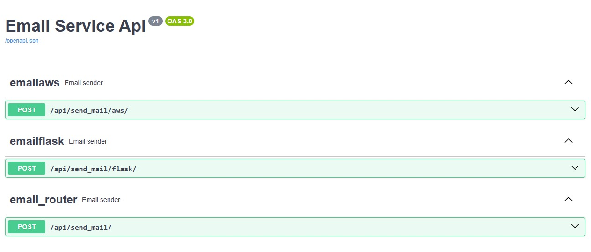

# Email Service
## Descrição
Esse repositório contém a solução de um antigo desafio voltado para o backend da Uber.

Consiste em desenvolver um serviço de e-mails que contém abstração entre os provedores de e-mail e uma forma com que a aplicação possa lidar caso um dos serviços fique offline.

Na minha solução implementei o AWS Simple Email Service e utilizei a biblioteca SMTPLIB para criar um serviço local na aplicação Flask, também fui além e desenvolvi além da solução proposta pela uber fiz endpoints para utilizar os provedores separadamentes, existe também um serviço de log registrando qual serviço de email foi utilizado para enviar um email.

Você pode checar a página do github do desafio em: [Desafio Uber](https://github.com/uber-archive/coding-challenge-tools/blob/master/coding_challenge.md)

## Tecnologias usadas
1. Flask, com flask e flask-smorest
2. AWS Simple Email Service
3. SMTPLib

A aplicação tem suporte ao Swagger UI portanto você pode acessar **.../swagger-ui** para checar a documentação da aplicação.



> [!NOTE]
> A documentação pode não estar completa visto que não configurei totalmente o swagger e também não possuo conhecimento para tal.

## Como replicar e rodar a aplicação
1. Clonar repositório
2. Criar um ambiente virtual python com ```py -m venv venv```
3. Iniciar o ambiente virtual (essa etapa pode ser diferente dependendo do seu sistema operacional):
```
.\venv\Scripts\activate
```
4. Instalar as dependências do projeto com ```pip install -r requirements.txt```
5. Ter em mãos as chaves de um usuário que tem permissões para usar o Amazon SES
6. Ter em mãos credenciais para usar um serviço de e-mail como: Google, Outlook (para usar o serviço baseado em SMTPLib)
7. Criar um arquivo na raiz do diretório chamado **.flaskenv**
8. Adicionar as seguintes variáveis necessárias:
```
FLASK_APP=app
FLASK_DEBUG=1
```
7. Para a utilização do Amazon SES:
```
AWS_ACCESS_KEY_ID=sua_chave_de_acesso
AWS_SECRET_ACCESS_KEY=sua_chave_secreta
```
8. Para utilização da biblioteca SMTPLib
```
MAIL_PORT=porta_do_serviço
MAIL_SERVER=servidor_do_serviço
MAIL_USER=usuario_para_autenticação
MAIL_PASSWORD=senha_para_autenticação
```
9. Rodar o servidor da aplicação utilizando o comando ```flask run```
   
## Utilização
Para utilizar a aplicação para enviar o e-mail você pode usar as endpoints no método POST:
1. ```/api/send_mail/```
Para enviar o e-mail utilizando o sistema de verificação de serviço disponível
2. ```/api/send_mail/flask/```
Para enviar o e-mail utilizando o serviço de SMTPLib
3. ```/api/send_mail/aws/```
Para enviar o e-mail utilizando o serviço da Amazon Simple Email Service

### Definição do body
Requer que o body seja um JSON
```
{
  "body": "Mensagem do e-mail",
  "subject": "Assunto do e-mail",
  "to": "Destinatário do e-mail",
}
```
